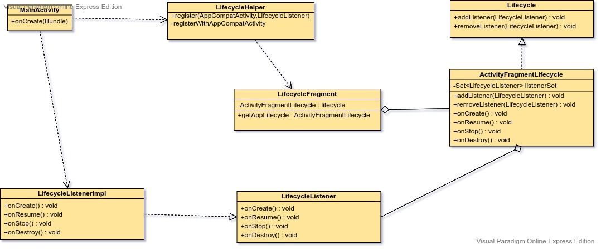

# 说明
参考Glide绑定生命周期的原理,将Lifecycle框架与Fragment生命周期相绑定。
# 使用
1.实现LifecycleListener接口
 
2.将LifecycleListener实现类和Activity/Fragment绑定
 
LifecycleHelper.getInstance().register(this,new LifecycleListenerImpl())

# 类图
